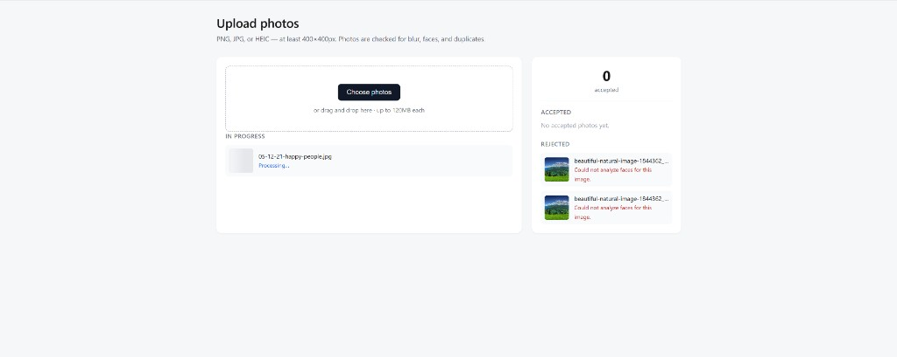

# Image upload (React + Node)

Simple photo upload flow with client-side format checks, MongoDB metadata (`imageId` + `storageKey`), and swappable cloud storage.

## Screenshot



## Structure

- `frontend/` — React (Vite), upload UI, polling for processing status
- `backend/` — Express REST API, Mongoose, Sharp (HEIC → JPEG), validations

## Storage provider

Set `STORAGE_PROVIDER` in `backend/.env`:

| Value | Behavior |
|-------|----------|
| `local` (default) | Files under `LOCAL_STORAGE_PATH`; previews via `/api/files/...` |
| `s3` | AWS S3; set `AWS_*` and `S3_BUCKET`; previews use signed URLs |
| `gcs` | Google Cloud Storage; set `GCS_BUCKET` and `GOOGLE_APPLICATION_CREDENTIALS` (path to service account JSON); optional `GCS_PROJECT_ID`; previews use signed URLs |

Upload and validation code only talk to `StorageProvider` — swap providers without changing business logic.

## Prerequisites

- Node.js 18+
- MongoDB running locally (or a cloud URI)

## Backend

```bash
cd backend
cp .env.example .env
npm install
npm run dev
```

API: `http://localhost:4000`

- `GET /api/images` — list metadata
- `POST /api/images` — multipart field `photos`
- `GET /api/images/:imageId` — single record
- `GET /api/images/:imageId/preview` — image bytes or redirect (S3)

## Frontend

```bash
cd frontend
npm install
npm run dev
```

Open `http://localhost:5173` (proxies `/api` to the backend).

## Validations (server)

1. Min file size and resolution (`MIN_*` in `.env`)
2. JPG / PNG / HEIC only
3. Perceptual hash similarity vs prior uploads
4. Blur (Laplacian variance)
5. Single face, minimum face size (`@vladmandic/face-api`)

Face detection uses TensorFlow.js BlazeFace (pure JS). Set `SKIP_FACE_DETECTION=true` in `.env` to disable face rules locally.

## MongoDB document

Each upload stores `imageId` (UUID), `storageKey` (object key in storage), status, rejection reasons, dimensions, and `perceptualHash` for duplicate detection.
